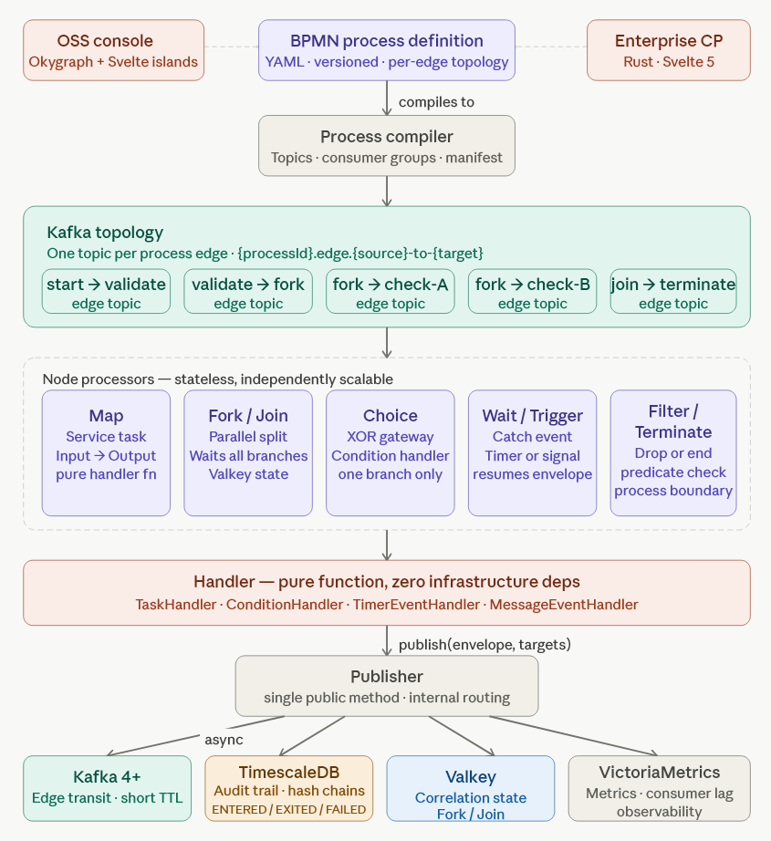

# Negotex

**Orchestrator-free BPMN workflow engine for compliance-heavy industries.**

Negotex compiles BPMN process definitions directly to message topologies — each edge becomes a Kafka topic, each node a stateless stream processor. No central coordinator. No database polling. No single point of failure.

> **Status:** Active development — PoC phase. Not yet production-ready.

---

## The core idea

Traditional workflow engines (Camunda, Temporal, Conductor) share an architectural pattern: a central orchestrator polls a database and dispatches tasks. That orchestrator is both the bottleneck and the single point of failure.

Negotex takes a different path. A BPMN process definition compiles to a message topology:

| BPMN concept | Negotex concept |
|---|---|
| Sequence Flow (edge) | Kafka topic |
| Task / Gateway (node) | Stateless stream processor |
| Token | `Envelope<T>` message |
| Process instance | Correlated message group |

Each node type scales independently. The messaging backend owns durability. The hot path never touches a database.

---

## Nine primitives

Negotex covers the full BPMN execution model with a minimal, orthogonal set of primitives:

| Primitive | BPMN equivalent | Behaviour |
|---|---|---|
| **Map** | Service Task | `Input → Output`, pure handler function |
| **Fork** | Parallel Gateway (split) | Fans out to all branches simultaneously |
| **Join** | Parallel Gateway (join) | Waits for all expected branches |
| **Choice** | Exclusive Gateway (XOR) | Routes to exactly one branch via condition |
| **Merge** | Inclusive Gateway (join) | Accepts first-arriving branch |
| **Filter** | — | Passes or drops envelope based on predicate |
| **Wait** | Intermediate Catch Event | Suspends until external signal or timer |
| **Trigger** | Start Event | Creates the envelope, entry point for the process |
| **Terminate** | End Event / Termination | Ends the process instance |

---

## Key properties

**No orchestrator.** The process graph *is* the message topology. Processors are stateless and independently scalable.

**Compliance-first.** Envelope hash chains produce a tamper-evident audit trail — `Hash(previousHash + result + timestamp + handlerVersion)` — without external systems or blockchain overhead. Neither Camunda nor Temporal offer native cryptographic chaining.

**Handlers are pure functions.** Business logic has zero infrastructure dependencies: `Input → Output`. The node processor handles all infrastructure concerns.

**Zero-downtime versioning.** Each process version gets isolated topics. Live processes drain while new versions go live — no coordinated cutover required.

**Execution contracts.** Every node declares its consistency model (deterministic or eventual) and every handler declares its runtime capabilities. Violations are caught at deployment, not at runtime.

---

## Architecture



**Handler lifecycle per node:**
1. Receive `Envelope<T>` from incoming Kafka topic
2. Persist `ENTERED` event to TimescaleDB (async)
3. Call handler: `Input → Output`
4. Publish outgoing envelope(s) to target topic(s)
5. Persist `EXITED` or `FAILED` event (async)

State persistence is fire-and-forget — it never blocks the hot path.

---

## Runtime stack

| Component | Role |
|---|---|
| Kafka 4+ (KRaft) | Edge transport — one topic per process edge |
| TimescaleDB | Audit trail + envelope event persistence |
| Valkey | Correlation state for Fork/Join |
| VictoriaMetrics | Observability |
| Java 21+ | Runtime — Virtual Threads for processor pools |

Redpanda is a supported drop-in for Kafka in lighter deployments.

---

## Handler example (Java)

```java
@NegotexHandler
public class CreditCheckHandler implements TaskHandler<LoanApplication, CreditResult> {

    @Override
    public CreditResult handle(LoanApplication application) {
        // Pure function — no Kafka, no DB, no framework imports
        var score = CreditScoring.evaluate(application);
        return new CreditResult(score, score >= 650);
    }
}
```

Process definition wires it up:

```yaml
nodes:
  - id: credit-check
    type: map
    handler: CreditCheckHandler
    edges:
      incoming: application-validated
      outgoing: credit-checked
```

---

## Deployment

**OSS (Docker Compose)** — standard runtime image + handler JAR on the classpath. No Docker rebuild for handler changes.

```yaml
services:
  negotex-runtime:
    image: negotex/java-runtime:latest
    volumes:
      - ./handlers/loan-app.jar:/handlers/loan-app.jar
    environment:
      NEGOTEX_HANDLERS_PATH: /handlers/loan-app.jar
      NEGOTEX_PROCESS_CONFIG: /config/loan-app.yaml
```

**Enterprise** — Kubernetes + Enterprise Control Plane. Each node type scales independently as a separate deployment.

---

## Multilanguage handlers

Handlers are not limited to Java. Negotex is building processor kits for:

| Kit | Phase | Target |
|---|---|---|
| `negotex-java` | Current | Enterprise Java shops |
| `negotex-fsharp` | Phase 2 | Financial markets, quant, risk |
| `negotex-rust` | Phase 3 | Systems-level, security-critical nodes |

F# is prioritised for Phase 2 because of its dominance in financial services domain modelling.

---

## Open-core model

| | Community (Apache 2.0) | Enterprise |
|---|---|---|
| Workflow execution engine | ✅ Full | ✅ |
| All nine primitives | ✅ | ✅ |
| Envelope hash chains | ✅ | ✅ |
| Execution contracts | ✅ | ✅ |
| OSS console | ✅ | ✅ |
| Multi-cluster management | — | ✅ |
| Blue/green deployments | — | ✅ |
| Process replay debugging | — | ✅ |
| Compliance reporting | — | ✅ |
| SLA + support | — | ✅ |

The community edition is complete and production-ready — not a teaser.

---

## Project status

- [x] Architecture decisions (22 ADRs across six levels)
- [x] arc42 concept document
- [ ] PoC implementation (Java / Spring Boot)
- [ ] `ProcessDefinitionBuilder` fluent API
- [ ] OSS console (Okygraph + Svelte islands)
- [ ] `negotex-fsharp` processor kit
- [ ] Enterprise Control Plane (Rust)

---

## Documentation

- [`/docs/adr/`](./docs/adr/) — Architecture Decision Records
- [`/docs/arc42.md`](./docs/arc42.md) — System architecture (arc42 format)

---

## License

Community edition: [MIT](LICENSE)  
Enterprise Control Plane: Commercial — contact for licensing.
